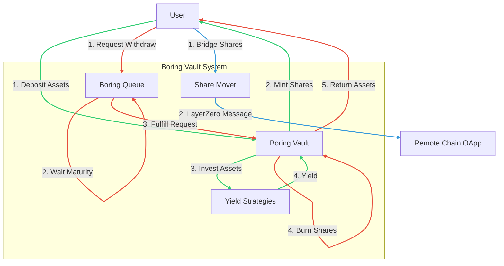

# Boring Vault SVM

A Solana-based implementation of the Boring Vault protocol, designed for secure and efficient asset management on the Solana Virtual Machine (SVM).

## 🚀 Quick Start

Get up and running in less than a minute!

### Prerequisites

- **Rust**: 1.81.0+
- **Solana Tool Suite**: Agave 2.0.15+
- **Anchor**: 0.32.1
- **Yarn**: 1.22+

### One-Command Dev Environment

We provide a unified script to start the local validator, build programs, deploy them, and run tests automatically.

```bash
./scripts/localnet-dev.sh
```

This script will:

1.  Start a local Solana validator (if not already running).
2.  Build all Anchor programs.
3.  Deploy programs to the localnet.
4.  Initialize the environment.
5.  Run the full test suite.

---

## 📦 Project Structure

The project is organized as a standard Anchor workspace with multiple interacting programs:

| Program           | Directory                         | Description                                                            |
| :---------------- | :-------------------------------- | :--------------------------------------------------------------------- |
| **Boring Vault**  | `programs/boring-vault-svm`       | Core vault logic. Manages deposits, withdrawals, and asset strategies. |
| **Boring Queue**  | `programs/boring-onchain-queue`   | Manages asynchronous withdraw requests and fulfillment queues.         |
| **Share Mover**   | `programs/layer-zero-share-mover` | Handles cross-chain share transfers via LayerZero (OApp).              |
| **Endpoint Mock** | `programs/endpoint-mock`          | Mocks the LayerZero endpoint for local testing.                        |
| **State Assert**  | `programs/state-assert`           | Utility program for asserting on-chain state during transactions.      |

## 🛠️ Key Dependencies & Configuration

This project uses the latest Solana development stack:

- **Solana Program**: `v3.0.0` (Latest major version)
- **Anchor**: `v0.32.1`
- **Switchboard On-Demand**: `v0.11.1` (Oracle)
- **Pythnet SDK**: `v2.3.1` (Oracle)

### Program ID Management

Program IDs are synchronized between `Anchor.toml` and the rust `declare_id!` macros.

**Important**: If you change program IDs or deploy to a new cluster, you must sync the keys:

```bash
anchor keys sync
```

This ensures that the program IDs in your Rust code match the keys used by Anchor for deployment.

## 🧪 Testing

To run tests manually without the full dev script:

```bash
# Run all tests
anchor test

# Run specific test file
anchor test --file tests/boring-vault-svm.ts
```

## 🔧 Architecture Overview



1.  **Deposits**: Users deposit assets (SOL/SPL) into the **Boring Vault**.
2.  **Shares**: The vault mints share tokens representing the user's ownership.
3.  **Strategies**: The vault manager (strategist) can deploy assets into various strategies (e.g., JitoSOL staking) to earn yield.
4.  **Withdrawals**:
    - Users request withdrawals via the **Boring Queue**.
    - Requests enter a maturity period.
    - After maturity, the request can be fulfilled, burning shares and returning assets.
5.  **Cross-Chain**: The **Share Mover** allows users to move their vault shares across different chains using LayerZero.

## 📄 License

This project is licensed under the MIT License - see the [LICENSE](LICENSE) file for details.
